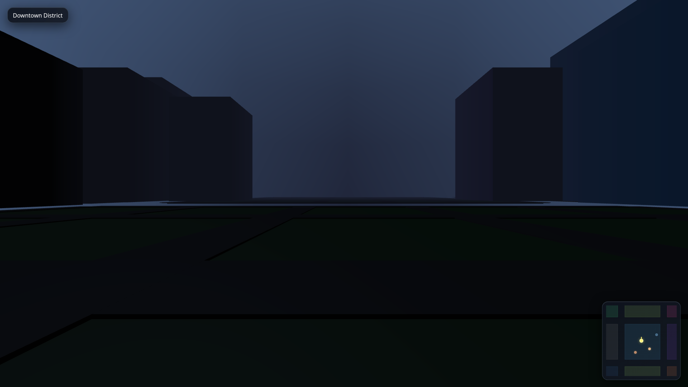
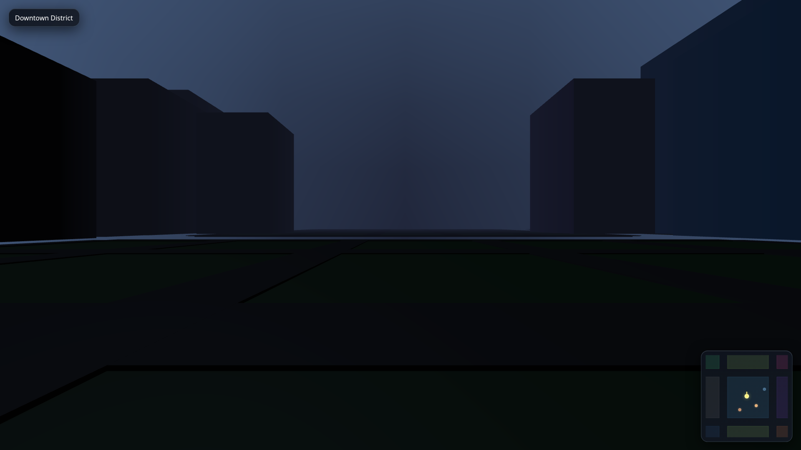
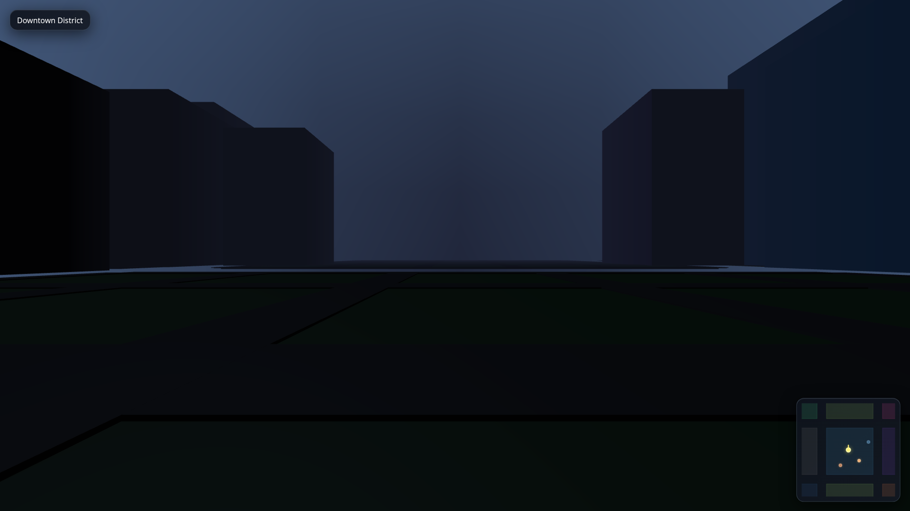
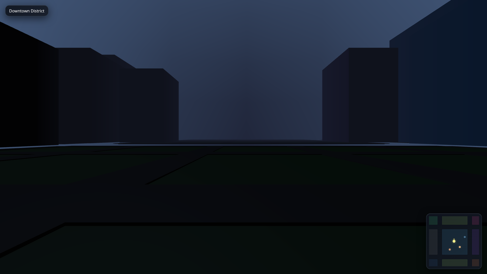
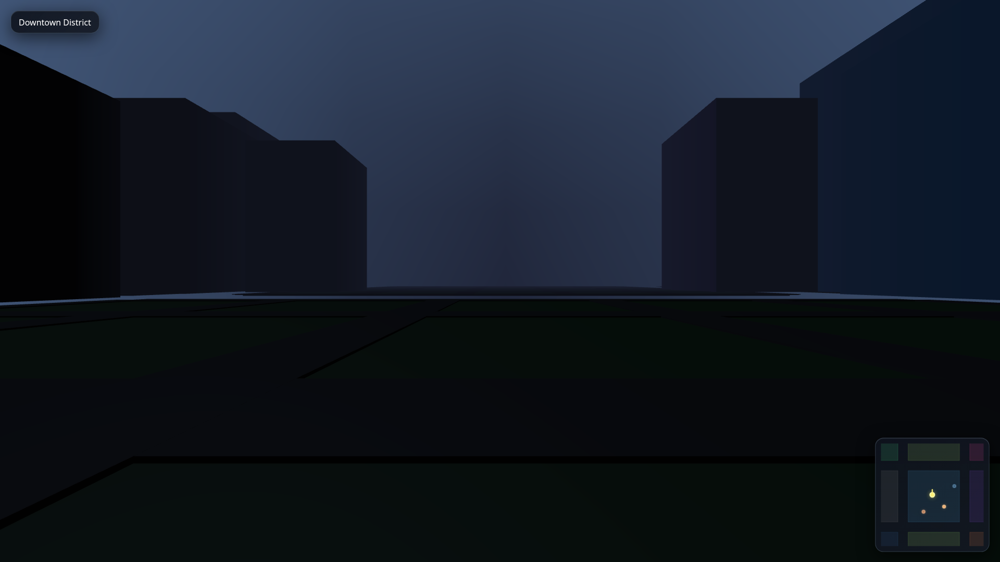

# Dev Tycoon Slice-2 - Screenshot Evidence

## Real PNG Files Captured

All screenshots captured via automated Playwright E2E flow on Sep 6, 2026.

### 1. Cafe Exterior
**File**: `cafe-exterior.png`  
**View**: Brown cafe building with flat roof from outside

### 2. Cafe Interior
**File**: `cafe-interior.png`  
**View**: Interior after entering, showing desk and warm lighting

### 3. HUD - Job Offered
**File**: `hud-accept.png`  
**Content**: Sol HUD showing "E — Accept: Quick bugfix (+$50)"

### 4. HUD - Job In Progress
**File**: `hud-fixing.png`  
**Content**: Sol HUD showing "Fixing…" state

### 5. HUD - Job Payout
**File**: `hud-payout.png`  
**Content**: Sol HUD showing "+$50" payout flash

---

## E2E Flow Verified

✅ Cafe exterior visible (brown building, flat roof)  
✅ Interior loads correctly (desk, lighting)  
✅ Job offer appears on entry  
✅ Accept state visible after E key  
✅ In-progress state visible  
✅ Payout flash captured  

**Automation**: Playwright script (`capture-screenshots.js`)  
**Duration**: ~43 seconds from spawn to payout  
**Files**: Binary PNG format, ~117KB each
